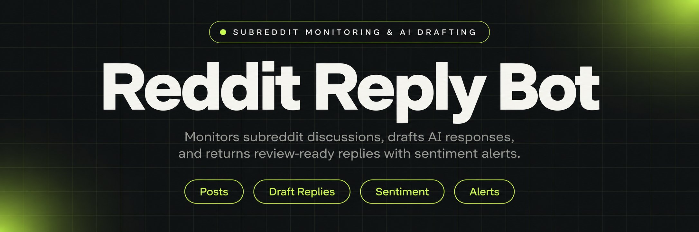
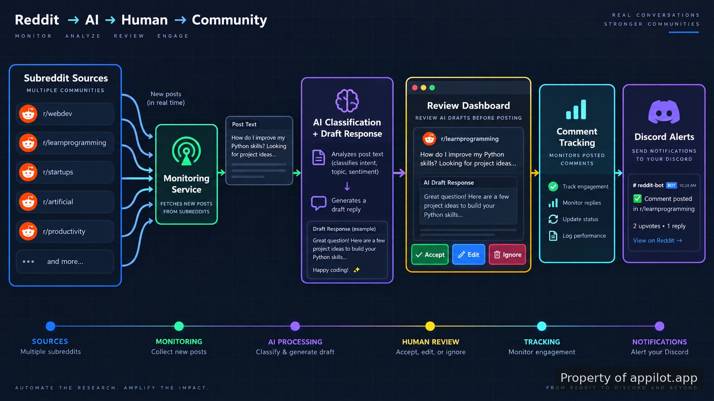

<p align="center">
  <a href="https://www.appilot.app" target="_blank" rel="nofollow">
    
  </a>
</p>

## reddit ai reply bot

reddit ai reply bot is a repository reference for a system that monitors configured subreddits, sends new post content through an AI model for classification and draft generation, then routes suggested replies through a review dashboard. The workflow separates discovery, response drafting, approval, and tracking so each stage can be inspected before a response is considered ready.

> A monitored discussion pipeline with human review before response actions.

The project focuses on the mechanics behind a Reddit response workflow rather than unattended posting. A typical run begins with subreddit configuration, checks for new posts, extracts the relevant text, creates a draft response, and stores the review state. The comment layer checks existing discussions for negative sentiment patterns and can send Discord alerts when attention is required.

<a href="https://www.appilot.app" target="_blank" rel="nofollow">
  
</a>

<p align="center">
  <a href="https://t.me/Bitbash333" target="_blank" rel="nofollow">
    
  </a>&nbsp;
  <a href="https://wa.me/923249868488?text=Hi%2C%20I%27m%20interested." target="_blank" rel="nofollow">
    
  </a>&nbsp;
  <a href="mailto:hello@appilot.app" target="_blank" rel="nofollow">
    
  </a>&nbsp;
  <a href="https://www.appilot.app" target="_blank" rel="nofollow">
    
  </a>
</p>



## Core Features

| Feature | Description |
| --- | --- |
| Subreddit Configuration | Finding relevant discussions manually across many communities can become inconsistent. The system uses configured subreddit sources so monitored areas are defined before collection begins. |
| Post Monitoring Pipeline | Missing new discussions delays response review. The monitoring layer checks incoming post content and passes captured information into the classification workflow. |
| AI Draft Generation | Writing every possible response from scratch creates review overhead. The system sends post text to an AI model that categorizes the discussion and produces a draft reply for evaluation. |
| Review Dashboard Actions | Publishing unapproved text creates unnecessary risk. The dashboard provides Accept, Edit, and Ignore review states before any response action is considered. |
| Comment Sentiment Tracking | Negative reactions can be difficult to notice in active threads. The comment tracker scans discussions for negative sentiment indicators and creates escalation events. |
| Discord Notifications | Important conversations can disappear inside a growing comment stream. Discord alerts surface selected negative sentiment events for faster review. |

## Subreddit monitoring workflow

The main workflow is organized around controlled movement of discussion data. A subreddit list acts as the input boundary. Each monitored source produces post records containing the text needed for classification, while the response layer keeps generated drafts separate from final decisions.

For example, a configured community can produce a new post containing a product question. The system captures the post content, sends it to the AI classification step, receives a category and draft response, and places that draft into the review queue. The operator can then decide whether the response should be accepted, edited, or ignored.

This separation removes a common failure mode in discussion automation: treating generated text as automatically approved output. The review stage remains a visible checkpoint, which is important when conversations depend on context, community rules, or tone.

## Reddit API connection layer

The data collection layer is designed around Reddit API access patterns. Developers working with this type of project should review the official API documentation before configuring requests: <a href="https://www.reddit.com/dev/api/" target="_blank" rel="nofollow">Reddit API documentation</a>. The API layer is responsible for obtaining discussion data that the monitoring workflow can process.

A typical flow keeps source collection separate from analysis. Reddit content enters the application, the classification service evaluates the text, and the dashboard receives a review item. Keeping these boundaries clear makes it easier to inspect failures, such as missing fields, rejected requests, or incomplete records.

## Sentiment analysis and alerts

Negative discussion signals are easy to overlook when comments accumulate. The sentiment analysis layer checks comment text and identifies conversations that require review rather than leaving important threads buried in activity.

When a comment matches the configured negative sentiment conditions, the system can create a Discord alert. The notification path uses Discord as the destination for review messages; developers can reference the platform documentation for available application features: <a href="https://discord.com/developers/docs/" target="_blank" rel="nofollow">Discord developer documentation</a>.

The alerting approach is intentionally focused on visibility. It does not replace human judgment about the meaning of a comment. A flagged discussion still requires someone to inspect the context before deciding what action is appropriate.

<a href="https://tally.so/r/yP5oDx?platform=GitHub&amp;format=Product+repo&amp;brand=Appilot&amp;niche=appilot&amp;page=Reddit+AI+Reply+Bot+with+Subreddit+Monitor&amp;date=2026-09-05" target="_blank" rel="nofollow">
  
</a>

## Technical stack

The project structure reflects a service that combines API communication, AI processing, storage, and review interfaces. The stack is organized around small components so each stage of the workflow can be tested independently.

| Component | Role |
| --- | --- |
| Python | Runs application logic, monitoring tasks, and processing workflows. |
| Reddit API | Provides access to configured discussion sources. |
| AI model integration | Classifies posts and drafts suggested responses. |
| Dashboard layer | Stores review states for Accept, Edit, and Ignore actions. |
| Discord integration | Delivers alerts for selected comment events. |

The AI model layer follows common application patterns where external model calls are isolated from collection logic. Developers can review model behavior separately from subreddit fetching, which helps identify whether an issue comes from input collection, classification, or response generation.

## Project structure

```text
reddit-ai-reply-bot/
├── src/
│   ├── reddit_monitor.py
│   ├── classifier.py
│   ├── response_generator.py
│   ├── sentiment_tracker.py
│   └── discord_alerts.py
├── dashboard/
│   └── review_queue.py
├── config/
│   └── subreddits.yaml
├── requirements.txt
└── README.md
```

## How to Monitor Subreddit Activity Using reddit ai reply bot

- **STEP 1 — Download & Set Up the Project** Download the repository and install reddit ai reply bot dependencies locally to prepare the configured monitoring environment.
- **STEP 2 — Open Review Dashboard** Start the application and open the dashboard interface to view collected posts and generated response drafts.
- **STEP 3 — Configure Sources** Select monitored subreddit entries and review configured fields such as source names, post content, and review settings.
- **STEP 4 — Run Monitoring** Trigger the monitoring process, then review returned drafts, stored decisions, sentiment events, and Discord notifications.

## Use Cases

- Community operators can review discussion drafts from selected subreddits without manually scanning every new post.
- Support teams can identify negative comment patterns through sentiment analysis and Discord alerts before conversations are missed.
- Developers can study a reference architecture for combining Reddit API collection, AI classification, and approval workflows.

## Setup and usage notes

The repository demonstrates the architecture behind a moderated response workflow. It should be configured with awareness of Reddit platform rules. Reddit's Terms of Service place restrictions on automated posting and commenting, so this project is intended to demonstrate system design and review mechanics rather than unattended activity.

Before running any integration, review the platform requirements and API guidance. The official documentation provides current rules and implementation details: <a href="https://www.reddit.com/dev/" target="_blank" rel="nofollow">Reddit developer resources</a>, <a href="https://www.redditinc.com/policies/content-policy" target="_blank" rel="nofollow">Reddit content policy</a>.

```bash
git clone repository-url
cd reddit-ai-reply-bot
pip install -r requirements.txt
python src/reddit_monitor.py
```

The command sequence starts the local project environment and launches the monitoring component. Production deployments require additional operational decisions around authentication, permissions, review processes, and platform compliance.

## Reference resources

The implementation patterns in this repository align with documented practices from the services involved. Useful references include <a href="https://platform.openai.com/docs/" target="_blank" rel="nofollow">OpenAI API documentation</a>, <a href="https://docs.python.org/3/" target="_blank" rel="nofollow">Python documentation</a>, and <a href="https://discord.com/developers/docs/" target="_blank" rel="nofollow">Discord API documentation</a>.

The project is most useful as a technical reference for developers evaluating how monitoring, AI drafting, approval queues, and alert delivery fit together. It shows the moving parts clearly enough to adapt the architecture for controlled environments.

## FAQ

### Can automated replies be posted directly to Reddit?

The repository demonstrates drafting and review mechanics rather than unrestricted automatic posting. Reddit's platform rules restrict automated posting and commenting behavior, so production use requires compliance checks and appropriate approval controls.

### What data does the monitoring system process?

The system processes configured subreddit content, including post text used for classification and draft generation, plus comment text used for sentiment checks. The workflow is designed around discussion records needed for review.

### How are negative comments detected and reported?

The comment tracking layer evaluates discussion text for negative sentiment indicators and can create Discord alerts when configured conditions are met. The alert provides a review signal rather than an automatic decision.

<table>
  <tr>
    <td align="center" width="33%">
      
      <p>This scraper helped me gather thousands of posts effortlessly. The setup was fast, and exports are super clean and well-structured.</p>
      <p><b>Nathan Pennington</b><br>Marketer<br>★★★★★</p>
    </td>
    <td align="center" width="33%">
      
      <p>What impressed me most was how accurate the extracted data is. Likes, comments, timestamps — everything aligns perfectly.</p>
      <p><b>Greg Jeffries</b><br>SEO Affiliate Expert<br>★★★★★</p>
    </td>
    <td align="center" width="33%">
      
      <p>It's by far the best tool I've used. Ideal for trend tracking, competitor monitoring, and influencer insights.</p>
      <p><b>Karan</b><br>Digital Strategist<br>★★★★★</p>
    </td>
  </tr>
</table>